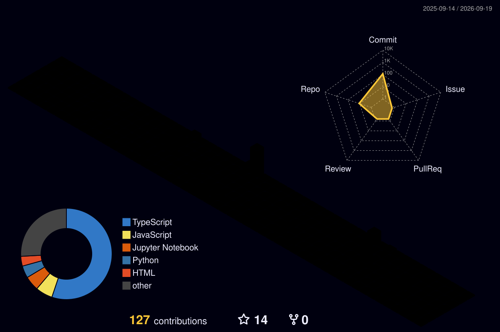

<h1 align="center">
  
</h1>

<h1 align="center">Sohaib Khattak</h1>

  

  BS Computer Science @ Abdul Wali Khan University Mardan (AWKUM) 🎓  
  Certified Agentic & Robotics Engineering (PIAIC) 🤖  
  📍 Peshawar, KPK, Pakistan

  📱 <a href="tel:+923259086590">+92 325 9086590</a> &nbsp;|&nbsp;
  💬 <a href="https://wa.me/923259086590">WhatsApp</a> &nbsp;|&nbsp;
  📧 <a href="mailto:sohaibktk.9058@gmail.com">sohaibktk.9058@gmail.com</a> &nbsp;|&nbsp;
  💼 <a href="https://www.linkedin.com/in/sohaib-khattak-b50497304/">LinkedIn</a>

 

### 🧠 AI & Agentic Tooling

  
  
  
  
  
  

 

  
  
  
  
  
  

 

### 💻 Languages & Frameworks

  
  
  
  
  

 

  
  
  
  
  

 

### 🛠️ Platforms & Data Tools

  
  
  
  
  
  

 

  
  
  
  
  
  

 

### 📊 Statistics

  

  

 

### 🚀 What I Work On
- 🧠 **Agentic AI & Automation** — building AI agents, MCP servers, and n8n-powered automation pipelines
- 📊 **Data Analytics** — data cleaning, EDA, and visualization with Power BI & ggplot2
- 🤖 **Machine Learning** — regression models, unsupervised learning, and applied research notebooks
- 🌐 **Full-Stack Development** — React, Next.js, and Flask apps backed by Firebase/Supabase
- 📚 **Continuous Learning** — growing my skills in Docker, SQL/NoSQL, and cloud-native workflows

### 🎯 Focus Areas & Interests

My core interest is **Agentic AI** — building AI systems that can reason, plan, and act autonomously rather than just respond to prompts. Alongside that, I focus on **automation** (n8n workflows, MCP servers) and **data engineering**, since real-world agentic systems live or die on the quality of the data and pipelines feeding them.

This combination — agents + automation + data — is where I want to build my career: designing autonomous systems that solve practical business problems end-to-end, not just isolated ML models. In the near term it's shaping the internships and projects I take on; longer term, I'm aiming toward roles building and shipping production agentic systems, where the automation and data-engineering foundation lets me take an idea from raw data to a working autonomous workflow.

**Market-facing expertise** — what I can design and build with this skill set:
- Autonomous AI agents and multi-agent systems using the Claude Agent SDK, MCP servers, and agent orchestration patterns
- Retrieval-Augmented Generation (RAG) pipelines and LLM-powered tools (Claude, GPT, Gemini, DeepSeek, Qwen)
- End-to-end automation workflows connecting apps, APIs, and data sources via n8n
- Full-stack web apps (React/Next.js/Flask) with Firebase/Supabase backends to serve AI features
- Data pipelines and analytics — cleaning, processing, and visualizing data (Power BI, ggplot2, Pandas)
- ML/DL model development and evaluation using TensorFlow/PyTorch, from preprocessing to metrics-driven evaluation

### 💼 Experience
- **Generative AI Intern** — Internee.pk *(June 2026 – Present)*
  Working on real-world Generative AI applications: LLMs, prompt engineering, AI automation, and intelligent workflows.
- **Certified Agentic & Robotics Engineering** — PIAIC *(August 2025 – Present)*
  Agentic AI and Robotics Engineering track with a strong Python/data-science/ML foundation, including AI-driven e-commerce solutions.
- **Artificial Intelligence Intern** — HexSoftwares Pvt. Ltd. *(March 2026 – April 2026)*
  1-month remote internship covering 4 AI projects across 4 weeks.

### 🎓 Education
- **BS Computer Science** — Abdul Wali Khan University Mardan (AWKUM) *(2023 – 2027)*
- **Certificate, Agentic & Robotics Engineering** — PIAIC *(2025 – 2027)*
- **Diploma of Education, Information Technology** — KP Board of Technical & Commerce Education *(2024)*

### 📜 Licenses & Certifications

**Agentic AI & Claude Ecosystem**
| Certification | Issuer | Date |
|---|---|---|
| Building Agentic AI Systems | Packt | Jun 2026 |
| Introduction to Model Context Protocol | Anthropic | Apr 2026 |
| AI Fluency: Framework & Foundations | Anthropic | Apr 2026 |
| AI Fluency for Students | Anthropic | Apr 2026 |
| AI Fluency for Educators | Anthropic | Apr 2026 |
| Introduction to Claude Cowork | Anthropic | Apr 2026 |
| Claude Code in Action | Anthropic | Apr 2026 |
| Claude Code 101 | Anthropic | Apr 2026 |
| Claude 101 | Anthropic | Apr 2026 |

**AI, ML & Data**
| Certification | Issuer | Date |
|---|---|---|
| AI Python for Beginners | DeepLearning.AI | Jun 2026 |
| Artificial Intelligence (ML/DL) | University of Engineering and Technology, Peshawar | Nov 2025 |
| AI For Everyone | DeepLearning.AI | Jun 2025 |
| Foundations: Data, Data, Everywhere | Google | Jun 2025 |
| Database Structures and Management with MySQL | Meta | Jun 2025 |

**Automation, Programming & Web**
| Certification | Issuer | Date |
|---|---|---|
| n8n Course Level 1 | n8n | Sep 2025 |
| Crash Course on Python | Google | Jun 2025 |
| Introduction to HTML, CSS & JavaScript | IBM | Jun 2025 |

**Events & Community**
| Certification | Issuer | Date |
|---|---|---|
| Hackathon'26 Participant, Peshawar | atomcamp | May 2026 |
| AWS Community Day | National University of Modern Languages (NUML) | Oct 2025 |

### 🧩 Skills

**Agentic AI & Claude Tooling**
`Multi-Agent Systems` `Agentic Systems` `Claude Agent SDK` `Claude Code Subagents` `Claude Skills` `MCP Server Integration` `CLAUDE.md Workflows` `Claude Hooks` `GitHub Integration` `Effective Prompting` `AI Fluency`

**AI / Machine Learning / Deep Learning**
`Supervised, Unsupervised & Reinforcement Learning` `Neural Networks & Optimization` `CNNs & RNNs` `TensorFlow` `PyTorch` `Model Evaluation (Accuracy, Precision, Recall, F1)` `Feature Engineering` `Predictive Modeling`

**Data Engineering & Databases**
`Data Engineering` `Data Cleansing & Processing` `Data Visualization` `Data-Driven Decision Making` `MySQL` `Relational Databases` `Database Design` `Query Languages`

**Programming & Web Development**
`Python` `Scripting` `Algorithms & Debugging` `HTML/CSS/JavaScript` `APIs` `Bootstrap` `Responsive Web Design`

**Automation & Strategy**
`Agentic AI Automation (n8n)` `Workflow Automation` `Strategic Thinking` `Data Ethics` `Market Opportunity Analysis` `Team Building`

### 📌 Projects

**🎓 Internee.pk — Generative AI Internship**
> Repo: [Internee-GenerativeAI-Chatbot-Internship](https://github.com/Sohaib-Khattak/Internee-GenerativeAI-Chatbot-Internship)
- **[Task 1 — AI Personalized Learning Assistant](https://github.com/Sohaib-Khattak/Internee-GenerativeAI-Chatbot-Internship/tree/main/task-1-ai-personalized-learning-assistant)** — Next.js + Firebase + DeepSeek v4, adaptive AI-driven learning platform
- **[Task 2 — AI Resume Evaluator](https://github.com/Sohaib-Khattak/Internee-GenerativeAI-Chatbot-Internship/tree/main/task-2-ai-resume-evaluator)** — Flask app with 40+ tests, spec-driven build, deployed on Render

**🗂️ Other Repositories**
- **[Multiverse Insights Hub](https://github.com/Sohaib-Khattak/multiverse-insights-hub)** — React + TypeScript + Supabase, data-driven insights dashboard
- **[AI Call Designer](https://github.com/Sohaib-Khattak/ai-call-designer)** — React + TypeScript + Supabase + Vitest, AI call-flow design tool
- **[Khattak Automation Hub](https://github.com/Sohaib-Khattak/khattak-automation-hub)** — n8n workflows for AI, data & business automation
- **[Learn-Log](https://github.com/Sohaib-Khattak/Learn-Log)** — ML notebooks (home price regression, unsupervised learning for functional data)
- **[SKILLS](https://github.com/Sohaib-Khattak/SKILLS)** — Centralized skill files for AI agents across multiple domains
- **[Agentic-AI-Documentary-](https://github.com/Sohaib-Khattak/Agentic-AI-Documentary-)** — Knowledge hub documenting CLI-based autonomous agent systems
- **[sohaib-khattak-portfolio](https://github.com/Sohaib-Khattak/sohaib-khattak-portfolio)** — Personal portfolio website (HTML)
- **[mcp-server-toolkit](https://github.com/Sohaib-Khattak/mcp-server-toolkit)** — Curated MCP server configs (time, web search, filesystem, fetch, sequential-thinking, memory) for AI agent tool access, compatible with Claude Desktop, Claude Code, Cursor & more
- **[CodeAlpha-Robotics-Internship-](https://github.com/Sohaib-Khattak/CodeAlpha-Robotics-Internship-)** — Robotics internship tasks at CodeAlpha
- **[OpenClaw-workspace](https://github.com/Sohaib-Khattak/OpenClaw-workspace)** — OpenClaw workspace/config
- **[Bellezone-Commerce-AI](https://github.com/Sohaib-Khattak/Bellezone-Commerce-AI)** — AI-powered e-commerce project
- **[scholarship-ai-agent](https://github.com/Sohaib-Khattak/scholarship-ai-agent)** — AI agent for scholarship-related assistance

### 🌐 Connect

  
  
  

